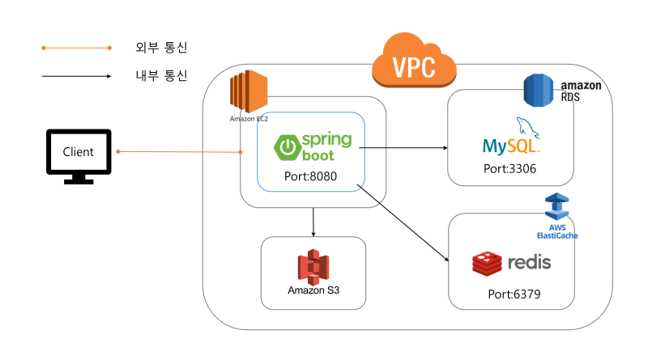

# 1. 프로젝트 소개

---

💡 **개발동기**  
혼자 구매하기에는 **양**이나 **배송비**가 부담스러워서 선뜻 구매를 망설였던 제품을 
*같은 이유로 구매를 망설이고 있는* ***주변 이웃과 연결**해주면 어떨까?* 
하는 생각에서 시작된 **P2P 소분 거래 플랫폼**입니다.

▶️ **타겟 유저**  
1인 가구, 배송비 아끼고 싶은 사람 등

▶️ **기대 효과**  
**실시간 채팅**을 통해 구매 의사를 조율하여
사용자가 **제품을 보다 쉽고 합리적으로 구매**를 할 수 있는 **편의 제공**

# 2. 프로젝트 구성도

---

# 3. 사용 기술 및 라이브러리

---

**Language/Framework**

- Java, Spring Boot Framework

**API/Library**

- JPA

**DB/Infra**

- AWS(EC2), AWS(S3), Amazon RDS for MySQL, AWS ElastiCache for Redis,

**Collaborate**

- Github, Notion
- # 4. 주요 기능

---

- 채팅 기능